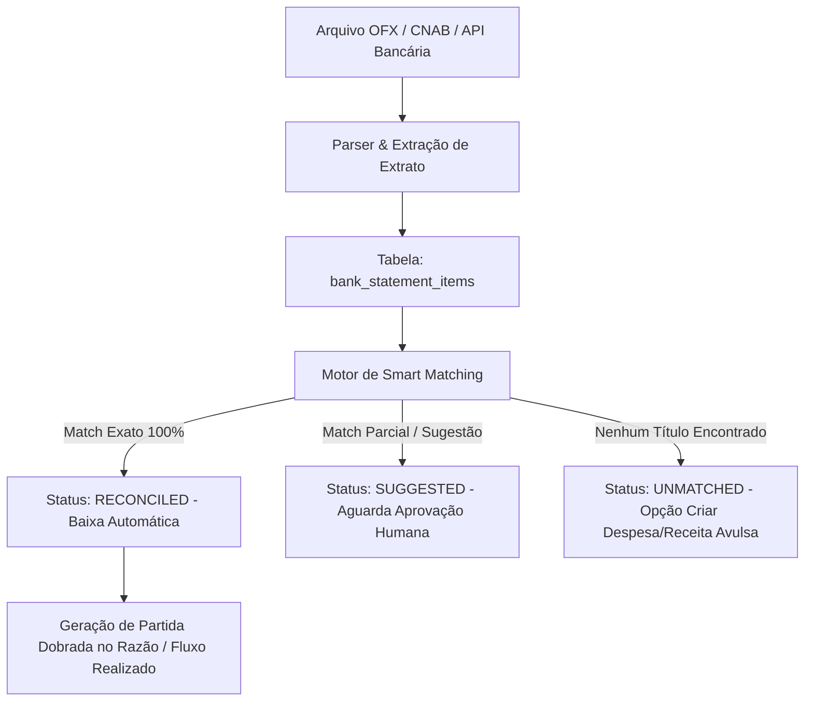

# FINANCIAL RECONCILIATION OPS - DIRETRIZES DE CONCILIAÇÃO BANCÁRIA

Este skill detalha a mecânica do motor de conciliação bancária inteligente do ERP Financeiro, assegurando conformidade contábil e auditoria completa.

---

## 🏦 1. FLUXO GERAL DA CONCILIAÇÃO

---

## 🔍 2. CRITÉRIOS DO SMART MATCHING ENGINE

O motor (`ReconciliationMatcher`) executa regras em cascata com pontuação de confiança (0 a 100%):

1. **Regra 1: Chave Única / NSU / Nosso Número (100% Confiança)**:
   - Se o campo `document_number` ou `fitid` do extrato for idêntico ao `our_number` do boleto gerado ou PIX end-to-end ID.
   - Ação: **Conciliação automática imediata**.

2. **Regra 2: Valor Exato + Data na Margem (+/- 3 dias) + Mesmo CNPJ/CPF (95% Confiança)**:
   - Valor bate até os centavos com título em aberto (`bills_to_pay` ou `bills_to_receive`).
   - Data da transação bancária dentro da janela de tolerância da data de vencimento.
   - Ação: **Conciliação com baixa automática (se parametrizado pela conta) ou sugestão em destaque**.

3. **Regra 3: Valor Exato + Similaridade Fonética do Favorecido (75% Confiança)**:
   - Valor idêntico ao título pendente, nome do favorecido similar via Levenshtein / Soundex.
   - Ação: **Sugestão para operador aprovar em 1 clique**.

---

## ⚖️ 3. REGRA CONTÁBIL DE PARTIDAS DOBRADAS (LEDGER)

Toda baixa de título conciliada gera transações pareadas no livro razão (`financial_ledger_entries`):

- **Ao Pagar um Fornecedor/Técnico (LPU/Aluguel POP)**:
  - **Débito (+)**: Conta de Passivo (Fornecedores a Pagar)
  - **Crédito (-)**: Conta do Ativo (Banco / Caixa)
- **Ao Receber de um Cliente (Assinatura Telecom)**:
  - **Débito (+)**: Conta do Ativo (Banco / Disponível)
  - **Crédito (-)**: Conta de Ativo (Clientes a Receber)

---

## 🛡️ 4. ATOMICIDADE E ROLLBACK

- O cancelamento ou estorno de uma conciliação deve reabrir o título pendente (`status = 'open'`), reverter o saldo da conta bancária e registrar a reversão no histórico com o ID do usuário responsável.
- **NUNCA** apague um `bank_statement_item` após conciliar; apenas altere seu status para `reconciled` ou `ignored`.
